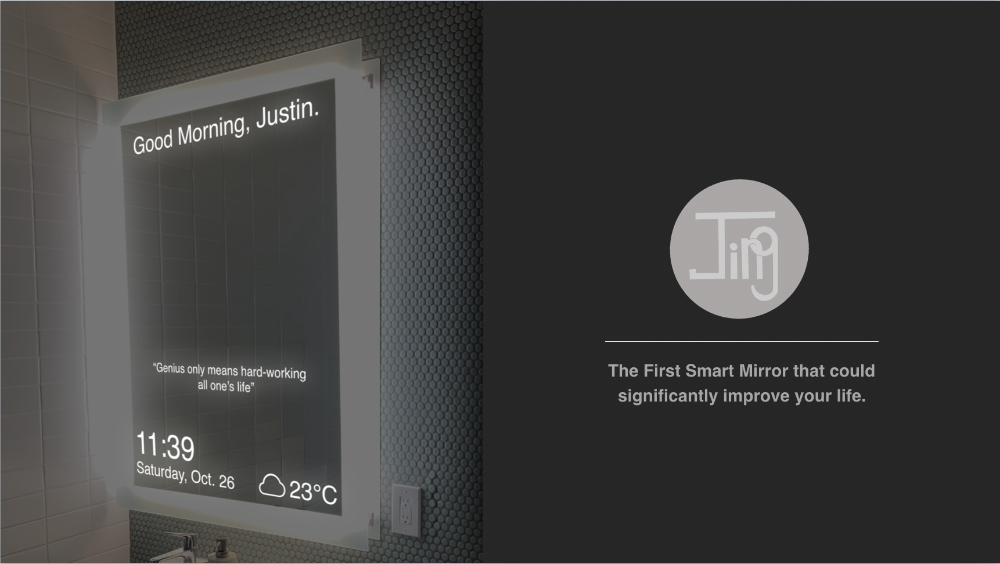

# JING

## Inspiration

One day morning, my roommate and I were getting up late. We are rushing for many kinds of stuff in the morning routine: preparing meals, brushing teeth, making the coffee, etc. However, because of the limited time, we are frustrated that we still forgot many things: we didn’t wear enough clothes as we didn’t check the temperature; I also forgot to bring my resume for an important career fair at that day. After that, we found that many people are usually facing difficulties in the morning: some people have a bad mood due to early wake-up time; some people want to listen for music or podcast conveniently; some people have trouble estimated travel time to the workplace. Therefore, all these difficulties inspired us to create JING, a smart mirror that could address the user’s difficulties in the morning.

## What it does

JING is a smart mirror that focuses on improving life quality and daily routine. JING included several major functions and toolkits: weather, clock, events, news, habit tracker, sleep & productivity tracker, estimated time to the workplace. When the user uses our products, all those information could be displayed at the bottom of the mirror, helping you better prepare for a fresh new day. To ensure a better personalized experience, It incorporates blocks design that provides users flexibility on choosing their own blocks to improve efficiency. Also, our smart mirror incorporates the Google Cloud pose control technology enabled by the camera, allowing interactive functions for the user to make simple gestures for switch blocks or unfolding blocks. Also, we made a welcoming page for our magic mirror with selected positive phrases and greeting sentences to help our users become more positive and prepared for their new day. 
 

## How we built it

To first built our JING prototype, we started for building our product by purchasing a 21-inch monitors and an acrylic sheet. We covered the monitor with acrylic sheet to reach the reflective effect that forms our first prototype mirror. For the software part, we built from scratch and all frameworks for our smart mirror. We used HTML to make the User Interface for the mirror with marvelous design. With python and javascript code supporting our HTML webpage, we adopt all APIs across different servers, including but not limited to weather, date, and news. Moreover, in addition to all those features above, we also implemented a real-time motion sensor based on Google Cloud PoseNet to provide fascinating user interaction with images. 

## Challenges we ran into

As a team with little experience on Hackathon, one of our biggest challenges is organizing all the works into the limited time ranges. Since all of our team members are more preferring working for a long-term project with several days of preparation for something. Therefore, we spent several hours brainstorming and creating a suitable plan for us to work. Also, for the coding skills, our team members are not that familiar with. Therefore, we also spent a lot of time to learn new skills by incorporating HTML, API, pose control, and all the other functions together.

## Accomplishments that we're proud of

The most accomplishment we're proud of is that we using our hardware and software skills to finally build a real prototype with the basic functions we design. Since we are incorporating different types of technology, and we actually met a lot of difficulties during finishing that. Therefore, we are really proud of finishing the entire prototype and the function of our mirror could be really useful for people to use during the morning time in the bathroom. From idealization to finishing the prototype, we spent much effort to make our idealized product come true.

## What we learned

This Cal Hackthon event actually taught us a lot: first, time management skill is really important for creating a product and ensure efficiency. Moreover, we definitely learn a lot of coding skills and advanced technological knowledge in this competition by exploring from Google Cloud, Microsoft, Facebook, and many other API and resources that companies provided. We also learned about how to use the advanced technology on solving the pressing problems that happened in our life.

## What's next for JING

For the future of JING, the first thing we want to do is to refine our prototype by testing our products and improve the function of our product, making it become more useful and stable. After that, we are planning to lead a larger project team with more skillful software engineer and product manager, satisfying more customers. Also, we planned to think more about the future plans on manufacture the mirror and reduce the cost of the product, making it be more accessible to the traditional family's life and positively influence people's morning and evening life.

 